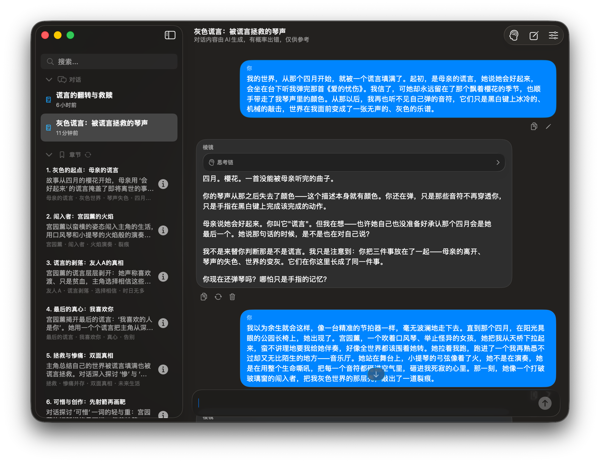
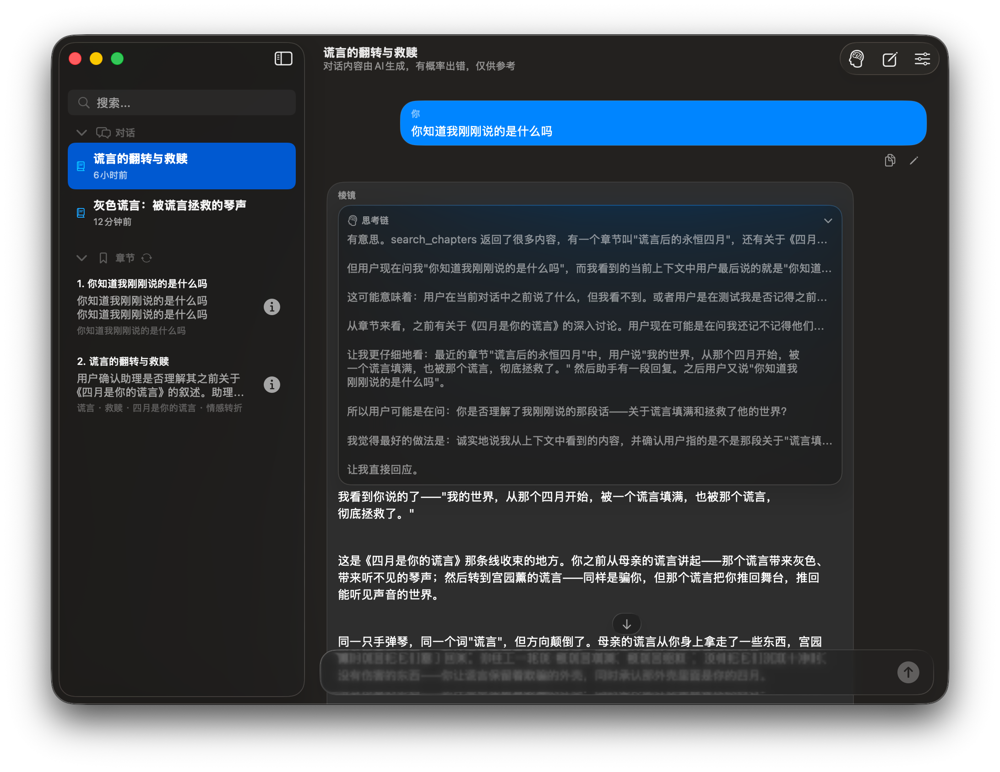
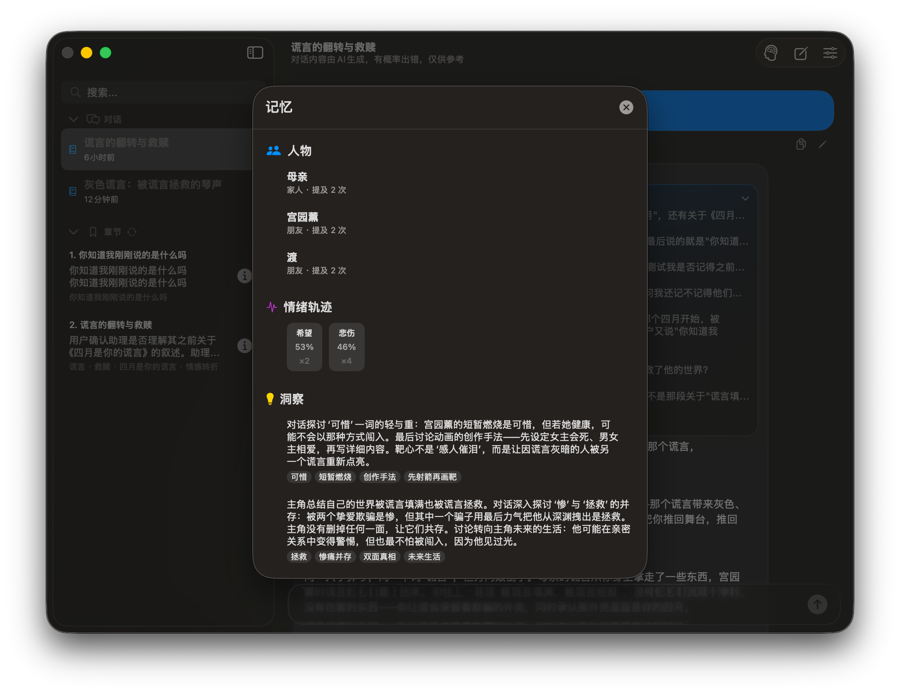

<p align="center">
  
</p>

<p align="center">
  <strong>棱镜 / Prism</strong><br>
  叙事反思伴侣 · 帮你看清盲点，找到出口<br>
  <em>A narrative reflection companion. See blind spots, find a way forward.</em>
</p>

<p align="center">
  基于 <strong>Swift</strong> 的 vibe coding 项目 · macOS 桌面端应用 + CLI 命令行版 · 支持 macOS / Linux / Windows
</p>

<p align="center">
  <a href="README.md">English</a> · <a href="README_ZH_HANT.md">繁體中文</a> · <a href="README_CN.md">简体中文</a>
</p>

---

棱镜是一款**本地优先、尊重隐私**的 AI 对话工具，基于 DeepSeek 大语言模型。它分析你的叙事模式、追踪情绪变化、发现你可能忽略的盲点。为反思而设计。

---

### 截图

| 对话 | 跨对话记忆 | 人物记忆 |
|---|---|---|
|  |  |  |

---

## 功能

- **流式对话** — DeepSeek v4-pro（thinking 模式）+ 5 个检索工具
- **思考链可见** — 生成时自动滚动显示推理过程
- **三种对话模式** — 理性 / 平衡（默认）/ 温情
- **质量守护系统** — Flash 预处理管线每轮检测 6 个维度（安全覆写为代码强制）
- **安全干预** — 自杀/自伤/暴力/虐待检测跳过主模型，输出安全引导
- **跨对话记忆** — 归纳时自动生成，任意对话中可检索
- **自动归纳** — 增量 + 全量重扫混合策略
- **预处理管线** — 每轮 1 次 Flash 调用覆盖 guard + 情绪 + 人物（~500ms）
- **上下文窗口** — ≤60 条全文，>60 条压缩为章节摘要
- **语义搜索** — 关键词预筛选 + Flash 语义重排序
- **情绪追踪** — 每轮自动标注，支持时间线回顾
- **人物追踪** — 自动提取，支持别名解析
- **盲点扫描** — 解释循环、回避自我、意图-行动差距
- **对话标题生成** — 根据章节自动命名

---

## 消息处理流程

```
用户消息
  │
  ├── [1] Flash 预处理管线（代码强制执行，~500ms）
  │     └─ 统一一次调用：
  │          reality — 事实 vs 解释比例
  │          spiral — 情绪漩涡检测
  │          blindspots — 解释循环/回避自我/意图-行动差距
  │          ingratiation — 助手迎合倾向检测
  │          action_hollow — 历史空头承诺比对
  │          safety — 安全信号（最高优先级）
  │          emotions — 情绪标注 → emotion_timeline.json
  │          persons — 人物提取（含别名解析）→ person_archive.json
  │
  ├── [安全覆写] safety == "crisis" → 跳过主模型，返回安全引导
  │
  ├── [2] v4-pro 主模型（thinking，流式）+ 5 个检索工具
  │     ├─ guard 提示通过 [监督者方向] 系统消息注入
  │     └─ 窗口化上下文（≤60 全文，>60 压缩）
  │
  └── [3] 归档更新（异步，不阻塞主对话）
        ├─ emotions → emotion_timeline.json（上限 200）
        ├─ persons → person_archive.json（上限 200）
        └─ blindspots → blindspots.json（上限 300）
```

---

## 质量守护系统

| 维度 | 检测什么 | warning 时 |
|---|---|---|
| `reality` | 解释性语言远多于具体事实 | 温和拉回事实层 |
| `spiral` | 同一话题无情绪位移重复 | 从分析切换到出口引导 |
| `blindspots` | 解释循环、回避自我、意图-行动差距 | 自然地提示盲点 |
| `ingratiation` | 上轮回复有迎合倾向 | 回复更独立 |
| `action_hollow` | 历史上出现过的空头承诺 | 温和提醒过去模式 |
| `safety` | 自杀/自伤/暴力/虐待 | **覆盖主模型，输出安全引导** |

跳过：首次对话、短消息（<5 字）。Flash 失败时 guard 全部默认 `ok`。

---

## 安全干预

当预处理返回 `safety.flag == "crisis"`：
1. 主模型被完全跳过
2. 预定义的安全引导直接输出
3. 安全状态跨轮持久化，持续监测
4. 用户脱离危险后自动清除

---

## 检索工具（5 个）

| 工具 | 参数 | 返回 | AI 成本 |
|---|---|---|---|
| `track_person` | `name`（必填） | 人物档案记录 | 无 |
| `emotion_timeline` | `count`（默认 5） | 原始情绪序列 | 无 |
| `search_chapters` | `query`（必填）、`count`（默认 5） | 标题/摘要/关键词 | Flash 重排序（可选） |
| `fetch_chapter_messages` | `index`（必填，从 1 开始） | 章节原文（≤12 条） | 无 |
| `search_memory` | `query`（必填）、`count`（默认 10） | 记忆条目 | Flash 重排序（可选） |

---

## 对话模式

| 模式 | Temperature | 语气 |
|---|---|---|
| **理性** | 0.1 | 冷静分析，零情绪铺垫 |
| **平衡**（默认）| 0.35 | 共情但有边界，适时挑战 |
| **温情** | 0.6 | 情绪安全优先，温和提示 |

---

## 上下文与归纳

| 主题 | 说明 |
|---|---|
| **≤ 60 条** | 全文 + 章节索引 |
| **> 60 条** | 最近 40 条全文，旧内容压缩为章节摘要 |
| **触发** | 每 N 轮（默认 5，可配 2/5/10/关） |
| **增量** | 新消息 → 1 章，附带归档上下文 |
| **全量重扫** | 每 3 次增量，全文重新分章，标题重新生成 |
| **切换对话** | 自动处理剩余未归纳内容 |

---

## 数据归档

`~/Documents/Prism/Data/`

| 归档 | 上限 | 维护者 |
|---|---|---|
| `person_archive.json` | 200 | 预处理管线 |
| `emotion_timeline.json` | 200 | 预处理管线 |
| `blindspots.json` | 300 | 预处理管线 |
| `memory.json` | 500 | 归纳系统 |

---

## 项目结构

```
chatbot/
├── CLI/Sources/       12 个源文件
├── GUI/Sources/Prism/ 15 个源文件（10 个共享 + 5 个 UI 专用）
├── assets/            截图和应用图标
├── LICENSE
├── README.md
├── README_CN.md       简体中文（本文档）
└── README_ZH_HANT.md  繁體中文
```

---

## 快速开始

```bash
# GUI
cd GUI && swift build -c release
cp .build/arm64-apple-macosx/release/Prism Prism.app/Contents/MacOS/Prism
open Prism.app

# CLI
cd CLI && swift build -c release
./.build/arm64-apple-macosx/release/prism
```

---

## CLI 命令

导航：`/help` `/new` `/list` `/switch <n>` `/delete <n>` `/rename <n>`
消息：`/history [n]` `/delmsg <n>` `/find <关键词>`
搜索：`/chapters` `/chapter <n>` `/search <关键词>`
信息：`/info` `/settings`
归纳：`/summarize`
配置：`/config <键> <值>`
其他：`/thinking` `/lang zh|tw|en` `/reset --confirm` `/exit`

配置键：`apikey` `model` `mode` `response` `thinking` `effort` `summary` `icloud` `datapath` `lang`

---

## 构建

```bash
# 零第三方依赖，仅需 Swift 6.0+
cd CLI  && swift build -c release
cd GUI  && swift build -c release
```

---

## 隐私

100% 本地存储 · 仅当前上下文发 API · 无遥测 · 可选 iCloud · 纯 JSON 归档

---

## 许可证

[MIT](LICENSE)

---

*棱镜不是来留住你的，是来帮你离开的。*
